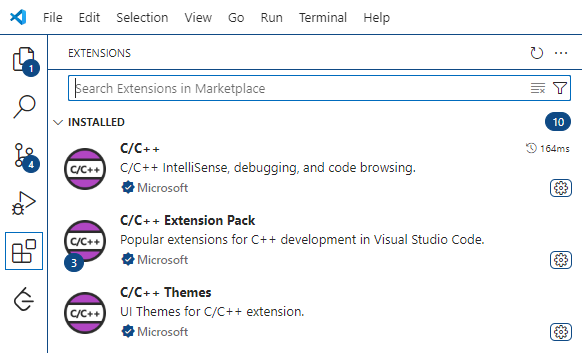

# C-code-Rehearsal
For Beginner Training C Code

## IDE (Intergrated Development Environment)
Using Visual Studio Code be the coding IDE on Windows.

## IDE Setup
1. Download <a href="https://code.visualstudio.com/">Visual Studio Code</a>  

2. Install the VS Code extension
    &nbsp;
    (<a href="https://code.visualstudio.com/docs/languages/cpp/">
        Reference
    </a>
    from official website.)   
    a. Open VS Code.  
    b. Select the Extensions view icon.  
    c. Search for "C++".  
    d. Install the extension.  
     

    

 
3. Install Compiler:
    &nbsp; 
    
        MinGW-w64 toolchain - Windows
    
    &nbsp;
    (<a href="https://code.visualstudio.com/docs/cpp/config-mingw#_prerequisites">
        Reference
    </a>
    from official website.)
      
    &emsp; 
    &emsp;
    a. Download the 
    <a href="https://github.com/msys2/msys2-installer/releases/download/2024-12-08/msys2-x86_64-20241208.exe">
        MSYS2
    </a>.
      
    &emsp; 
    &emsp;
    b. Run the Installer.
      
    &emsp; 
    &emsp;
    c. Run 
    
        MSYS2 
    
    after finish install.
      
    &emsp; 
    &emsp;
    d. Install the MinGW-w64 toolchain by:
      
    &emsp; 
    &emsp;
    <pre><code>
    pacman -S --needed base-devel mingw-w64-ucrt-x86_64-toolchain
    </code></pre>
      
    &emsp; 
    &emsp;
    e. Accept the default packages in the toolchain group by pressing
    
        Enter & Y
    .
      
    &emsp; 
    &emsp;
    f. Add MinGW-w64
    
        bin
     
    folder to Windows
    
        PATH
     
    environment vairable:
      
    &emsp; 
    &emsp;
    <pre><code>
    C:\msys64\ucrt64\bin
    </code></pre>
      
    &emsp; 
    &emsp;
    g. Checking MinGW-w64 tools are correctly installed by
    
        Command Prompt
    :
      
    &emsp; 
    &emsp;
    <pre><code>
    gcc --version
    g++ --version
    gdb --version
    </code></pre>

## Outline
1. Print & Scan & Comment
2. Variables & Data Types
3. Calculate Samples
4. Structure
5. Condition Statement
6. Simple Functions
7. Files
8. Pointer